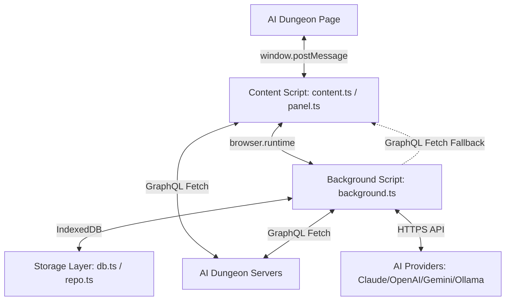

# AID Story Helper - Developer Documentation

This document serves as the high-density directory map, architectural guide, and developmental checklist for the **AID Story Helper** extension.

> [!IMPORTANT]
> **To Future AI Coding Assistants**: 
> 1. Read this document *first* to orient yourself before executing code changes.
> 2. **Always update this document** immediately after implementing architectural changes, adding new configurations, altering data models, or introducing new files.
> 3. Keep explanations crisp, token-efficient, and structured for quick parsing.
> 4. **DO NOT search the web** for AI Dungeon GraphQL APIs or features we are implementing in this project. The features, endpoints, and mutations we are developing are custom or sandboxed, and information about them does not exist on the public web.

---

## 1. System Architecture

The extension uses a multi-layered Chrome/Firefox Extension Architecture (Manifest V3) composed of three isolated context scopes:



### Context Isolation & Responsibilities
1. **Injected Script (`src/interceptor/injected.ts`)**:
   - Runs directly in the context of the AI Dungeon page.
   - Proxies the browser's global `window.fetch` **and `XMLHttpRequest`** (`open`/`send`) to intercept GQL requests/responses on whichever transport AID uses for a given call.
   - Hooks outgoing WebSocket frames to intercept streaming actions.
   - **Unified action interception (`maybeInterceptAction(batch)`)**: a single helper detects an `ActionRequest` in a (possibly batched) GQL payload, holds transmission, and awaits MemorAID thoughts before release — shared by the fetch and XHR proxies (correlated by a per-request id via `pendingActionResolvers`).
   - Implements **Synchronous Action Interception**: pauses action execution, updates the user interface placeholder to reflecting states, blocks GQL transmission until thoughts are updated, and releases GQL calls.
   - Updates open card editor textareas (`ENTRY` and `NOTES` / `description`) directly in the DOM when approved or synchronized card updates are received, bypassing React state synchronization lag.
   - **Page Card-Write Forwarding (`cardWrites`)**: Forwards the FINAL (post-override, post-dedup) inputs of every page-originated `UseAutoSaveStoryCard`/`SaveQueueStoryCard` to the content script, which routes them into the background `cardsUpdate` handler (local DB + MemorAID config cache). This is the live propagation path for GUI card edits (e.g. `Configure MemorAID`) on beta, where the server does not reliably broadcast `AdventureStoryCardsUpdate` over WS — previously such edits only reached the extension on the next page reload.
2. **Content Script (`src/content/content.ts` & `src/content/panel.ts`)**:
   - Runs in an isolated extension context but shares the DOM with the AI Dungeon page.
   - `content.ts` acts as the messaging bridge between the injected page script (`injected.ts`) and the extension's background process.
   - `panel.ts` builds the Shadow DOM sidebar UI panel, registers event handlers, and renders state variables.
   - Bridges panel updates back to the content script using a direct, synchronous `onRefresh` callback bridge to trigger immediate sidebar repaints on user-initiated database actions (such as hiding/restoring adventures), falling back to CustomEvents.
   - Includes **OffMeta's AIN Repository settings tab** which fetches and parses rules from the OffMeta Google Doc using `src/shared/offmeta-parser.ts` and allows one-click applying.
3. **Background Script (`src/background/background.ts`)**:
   - Runs in the extension background service worker.
   - Orchestrates AI completion calls, coordinates DB updates, and replays GraphQL requests.
4. **Storage Layer (`src/storage/db.ts` & `src/storage/repo.ts`)**:
   - Manages state database stores (IndexedDB via the `idb` library).
   - Abstracts queries/inserts for settings, story cards, game actions, and proposal logs.

---

## 1.1 Data Models & Storage (IndexedDB Schema)

All data is stored locally in IndexedDB under the database name `"aid-tracker"` (version `4`). The database schema (defined in `src/storage/db.ts`) contains the following stores:

### 1. `adventures`
- **Key Path**: `shortId` (string)
- **Value Fields**:
  - `shortId` (string, primary key)
  - `title` (string, optional)
  - `protagonistName` (string, optional)
  - `memory` (string, raw Plot Essentials block, optional)
  - `lastAnalysisAction` (number, optional)
  - `aidMemories` (array of memory objects, optional)
    - Shape: `{ actionIds: string[], text: string, lastRelevantActionId?: string, isUsed?: boolean, active?: boolean }[]`
  - `lastAutoUpdatedCard` (string, optional)
  - `authorsNote` (string, optional, cached Author's Note text)
  - `instructions` (string, optional, cached AI Instructions text)
  - `createdAt` (string, ISO timestamp)

### 2. `actions`
- **Key Path**: `["shortId", "id"]`
- **Index**: `"by-shortId"` (key: `shortId`)
- **Value Fields**:
  - `shortId` (string)
  - `id` (string, action ID from AID)
  - `text` (string)
  - `type` (string, e.g., `"do" | "say" | "story" | "continue" | "see"`)
  - `createdAt` (string, optional)
  - `updatedAt` (string, optional)

### 3. `operations` (GQL Query Cache)
- **Key Path**: `operationName` (string)
- **Value Fields**:
  - `operationName` (string, e.g., `"GetGameplayAdventure" | "UseAutoSaveStoryCard" | "SaveQueueStoryCard" | "EditMemory" | "UpdateAdventurePlot"`)
  - `query` (string, full GQL query body string)
  - `variableKeys` (array of strings, e.g., `["shortId", "limit"]`)
  - `kind` (`"read" | "write"`)
  - `learnedAt` (string, ISO timestamp)

### 4. `cards` (Story Cards)
- **Key Path**: `["shortId", "id"]`
- **Index**: `"by-shortId"` (key: `shortId`)
- **Value Fields**:
  - `shortId` (string)
  - `id` (string, card ID)
  - `type` (string, e.g., `"character" | "location" | "faction" | "memory"`)
  - `title` (string, name)
  - `keys` (string, triggers comma-separated)
  - `value` (string, entry text)
  - `description` (string, optional notes/historical thought logs)
  - `deletedAt` (string, optional ISO timestamp for soft delete)

### 5. `versions` (Proposed PE/Card updates)
- **Key Path**: `id` (string)
- **Index**: `"by-shortId"` (key: `shortId`)
- **Value Fields**:
  - `id` (string, UUID)
  - `shortId` (string)
  - `characterName` (string)
  - `entry` (string, proposed new value)
  - `changeSummary` (string)
  - `triggers` (string, optional)
  - `status` (`"pending" | "applied" | "rejected"`)
  - `createdAt` (string, ISO timestamp)
  - `source` (`"card" | "plot"`)
  - `pushedAt` (string, optional ISO timestamp of AID server sync)
  - `actionCount` (number, optional)
  - `cardId` (string, optional — the Story Card this version targets; rename-proof tracking, see §D)
  - `cardType` (string, optional — the targeted card's type, stamped at generation time)

### 6. `settings` (Extension settings singleton)
- **Key Path**: `_k` (string, hardcoded to `"singleton"`)
- **Value Fields**:
  - `provider` (`"claude" | "openai" | "gemini" | "ollama"`)
  - `model` (string, optional)
  - `apiKeys` (Record<string, string>, optional)
  - `analyzeWindow` (number, default `20`)
  - `showDebug` (boolean, optional)
  - `theme` (string, optional)
  - `customPrompt` (string, optional)
  - `customPromptSection1-4` (string, optional prompt overrides)
  - `typeGuidance` (Record<string, string>, per-card-type custom AI guidance)
  - `useMemories` (boolean, optional)
  - `cardCommands` (Record<string, string>, GQL Generation templates per type)
  - `formattingMode` (string, default `"squareBrackets"`)
  - `memoraidLookback` (number, default `8`, narrative-action context window for thought generation)
  - `memoraidThoughtLookback` (number, default `0`, rolling thought window: N complete PRIOR thoughts kept in the card entry and fed as context; `0` = single fresh thought only — see §A)
  - `memoraidPresenceLookback` (number, default `5`)
  - `interceptTimeout` (number, default `4`)
  - `autoRegenerateNativeMemories` (boolean, optional — auto-regen the latest Memory Bank block, see §H)
  - `useSinglePassGeneration` (boolean, optional — 1-pass vs 4-pass character generation, see §E)
  - `locationMode` (`"optionA" | "optionB"`, default `"optionA"`, Active Location Manager mode, see §K)
  - `enableProperNounDetection` (boolean, opt-out/ON by default, see §K)
  - `manualMode` (boolean, optional — when set, suppresses automatic background auto-update triggers)

### 7. `globalAssets`
- **Key Path**: `id` (string)
- **Index**: `"by-type"` (key: `type`)
- **Value Fields**:
  - `id` (string, primary key)
  - `type` (string, `"ain" | "an" | "pe" | "sc"`)
  - `title` (string)
  - `keys` (string, optional)
  - `value` (string)
  - `description` (string, optional)
  - `createdAt` (string, ISO timestamp)
  - `cardType` (string, optional)

---

## 1.2 IPC Messaging Contract (BgMessage)

The communication contract between content scripts (panel UI) and the background page (defined in `src/background/orchestrator.ts`):

| Message Kind | Payload Fields | Purpose |
|---|---|---|
| `actionUpdate` | `shortId`, `payload: ActionUpdatePayload` | Pushes streaming/intercepted gameplay actions into background memory/db. |
| `adventureMeta` | `shortId`, `title?`, `memory?` | Passes title and Plot Essentials block updates. |
| `exportRequest` | `shortId` | Requests exporting the adventure history as a compiled text file. |
| `authToken` | `token` | Captures the active player's AI Dungeon session/authorization token. |
| `learnedOp` | `ops: GqlOp[]`, `endpoint?` | Registers intercepted GQL queries/mutations and API endpoint. |
| `backfillRequest` | `shortId` | Triggers a paginated backfill scrape of older actions via AID's GQL. |
| `cardsUpdate` | `shortId`, `cards: CardRow[]` | Updates locally cached story cards. |
| `setSettings` | `settings: Settings` | Saves modified settings singleton. |
| `setProtagonist` | `shortId`, `name: string` | Records the protagonist character name. |
| `analyzeRequest` | `shortId` | Triggers an AI analysis pass for Plot Essentials/Story Cards updates. |
| `generateCard` | `shortId`, `cardId` | Triggers sequential multi-pass native GQL generation on AID for a card. |
| `setVersionStatus` | `id`, `status: Version['status']` | Approves or rejects a pending AI version update. |
| `applyToAid` | `id` | Pushes approved pending version changes to AI Dungeon servers via GQL. |
| `getState` | `shortId` | Retrieves current state (actions, cards, versions, settings) for panel display. |
| `listModels` | *(none)* | Queries available models for the selected provider. |
| `adventureMemories` | `shortId`, `memories: any[]` | Puts the full list of raw AID-generated memories into the database. |
| `updateAidMemories`| `shortId`, `memories: any[]` | Triggered when a user edits/deletes a native AID memory in the panel. |
| `createConfigCard` | `shortId` | Creates a new companion memory card configuration card on AID. |
| `createStoryCard` | `shortId`, `card: { type, title, keys, value, description? }` | Creates a new story card whole-cloth and pushes it to AID via GQL mutation. |
| `saveCardKeys` | `shortId`, `cardId`, `keys` | Saves updated trigger keys for a story card and replays the GQL mutation to update AID. |
| `processInterceptedAction` | `shortId`, `text: string`, `type: string` | Inspects live input to check for MemorAID presence triggers. |
| `memoraidTiming` (broadcast) | `payload: { lastMs, avgMs, count }` | Background→tabs push of session-scoped MemorAID intercept-path timing for the readout under Action Intercept Timeout. |
| `refineMemoryBlock` | `shortId`, `index` | Triggers native GQL generation to refine/regenerate a specific memory block. |
| `getManagerData` | *(none)* | Retrieves all local adventures, all story cards, all global assets, and general settings. |
| `saveGlobalAsset` | `asset: GlobalAsset` | Saves or updates a global asset in the local IndexedDB. |
| `deleteGlobalAsset` | `id: string` | Deletes a global asset from the local IndexedDB. |
| `importGlobalAsset` | `shortId`, `assetId` | Fetches a global asset and applies it to the active play session using GraphQL mutations. |
| `saveCardValue` | `shortId`, `cardId`, `value` | Saves a Story Card's entry `value` directly (panel-side card editing) and replays `UseAutoSaveStoryCard` to AID (+ `approvedCardSync` broadcast). |
| `exportAll` | *(none)* | Returns a full backup of every IndexedDB store as `{ __aidBackup, dbVersion, exportedAt, stores }` — **API keys are stripped** from the settings singleton (see §M). |
| `importAll` | `data` | Restores a backup produced by `exportAll`; upserts by key (merges into, never wipes, existing data; device API keys are preserved). |
| `isDbEmpty` | *(none)* | Returns `{ empty }` — true when no adventures exist (freshly-installed / origin-swapped empty DB), used to surface the self-heal restore banner. |

---

## 1.3 Authentication Caching & Session Store

- **Auth Token & Endpoint Storage**: The GQL `sessionToken` (AID Authorization header) and `gqlEndpoint` are held in memory in the background worker and mirrored ONLY to `browser.storage.session` — an in-memory, session-scoped store that is **never written to persistent disk**. `rememberAuth()` writes there alone (no `storage.local`).
- **Why session-only is sufficient**: `storage.session` already survives MV3 worker recycling *within* a browser session — the actual problem `ensureAuth` solves. It is cleared on browser close, but every background op that needs auth (auto-update, MemorAID, memory regen) is downstream of page activity, and the fetch/XHR interceptor re-captures a fresh token from the first authenticated page request each session. So disk persistence bought almost nothing while exposing the bearer token at rest — it was removed.
- **Disk scrub**: at module load the worker calls `browser.storage.local.remove(["aidToken", "aidEndpoint"])` once, to clean up any token a prior build had mirrored to disk. (The `storage` permission in `manifest.json` backs `storage.session` and this scrub.)
- **Rehydration**: `ensureAuth()` (in `src/background/background.ts`) is idempotent — returns early if both are in memory, else fills them from `storage.session`. It is `await`ed at the top of every handler that performs a GQL write (`checkMemorAIDUpdates`, `regenerateMemoryBlock`, `updateAidMemories`, `saveCardValue`, …) so a recycled worker never proceeds tokenless.

---

## 1.4 Text Parsing & Formatting Functions

Several helper modules handle the parsing of complex blocks:

### 1. Plot Essentials Parsing (`src/inference/plot.ts`)
- **`parsePlotEssentials(memory)`**: Scans the raw memory block for top-level bracketed `[...]` or braced `{...}` blocks (e.g. `[Name is ...]` or `{Name: ...}`), ignoring general lore sections. Returns an array of `PlotBlock` items.
- **`parseMemories(memory)`**: Extracts the inner block of `[Memories (newest to oldest):\n...]` from Plot Essentials.
- **`replaceBlock(memory, name, newEntry)`**: Finds the bracketed/braced block corresponding to `name` (case-insensitive) or `"memories"` and replaces it with `newEntry`, preserving the original wrapping format (`[...]` or `{...}`).

### 2. Gameplay Fetch Parser (`src/sync/gameplay-fetch.ts`)
- **`parseGameplayResponse(json)`**: Extracts the list of actions (`RawAction[]`), adventure title, total action count, story cards, and the list of native AID memories (`gameState.memories` or `state.memories`) from the `GetGameplayAdventure` API response.

### 1.5 CORS Bypass & GraphQL Fetch Relaying
To ensure bulletproof reliability in strict browser contexts (such as Firefox Manifest V3 where required host permissions are not automatically granted upon installation and must be explicitly enabled by the user), the background script implements a module-scoped `fetchWithRelay` proxy:
1. **Background Fetch (Primary)**: The service worker/background script performs direct `fetch()` calls to `api-alpha.aidungeon.com/graphql`. This is highly concurrent and does not block the UI.
2. **Page Context Relay (Fallback)**: If the background fetch fails with a `NetworkError` (indicating a CORS block or inactive host permission), `fetchWithRelay` intercepts the request:
   - It parses GQL variables from the request `body` to extract the adventure's `shortId`.
   - It queries open tabs for an AI Dungeon adventure matching this ID.
   - It sends a `relayFetch` message via `browser.tabs.sendMessage` to [content.ts](file:///C:/Users/x509x/Documents/Claude/src/content/content.ts).
   - [content.ts](file:///C:/Users/x509x/Documents/Claude/src/content/content.ts) bridges this request to [injected.ts](file:///C:/Users/x509x/Documents/Claude/src/interceptor/injected.ts) (in the page/MAIN world context) using `window.postMessage`.
   - **Hybrid DOM Event Execution**: In [injected.ts](file:///C:/Users/x509x/Documents/Claude/src/interceptor/injected.ts), to break the script call stack association that Firefox uses to trace requests back to the extension (which forces `Origin: moz-extension://...` and causes preflight OPTIONS CORS errors), the request is serialized and placed inside a temporary DOM element's `onclick` attribute. The click event is programmatically triggered (`el.click()`), which executes the fetch natively within the page's event dispatcher under the page's own origin (`https://alpha.aidungeon.com` or `https://play.aidungeon.com`).
   - **CSP Fallback**: If the page implements a strict Content Security Policy (CSP) that blocks inline event attributes, the event dispatcher throws a CSP violation and inline execution fails. To handle this, a 150ms timeout safety gate is set; if the DOM click response listener does not resolve within 150ms, it falls back to a direct `_fetch` call.
   - The response status, headers, and body text are marshaled back via `postMessage` to the content script, which resolves the background's `sendMessage` promise, resuming background execution seamlessly.

### 1.5.1 Claude Prompt Caching
The Claude provider (`src/inference/claude.ts`) uses Anthropic **prompt caching** to cut input-token cost on operations that make multiple calls sharing a large stable prefix. `Provider.complete(system, user, cachePrefix?)` takes an optional `cachePrefix`: the stable leading portion of the user turn. Claude sends it as a separate `cache_control: {type:"ephemeral"}` content block (the breakpoint caches `system` + `cachePrefix` together — a prefix match); other providers (OpenAI/Gemini/Ollama) just concatenate `cachePrefix + user` (no caching). Callers pass `cachePrefix` ONLY when reuse is guaranteed, so the ~1.25× cache-write premium is always amortized by ≥1 read:
- **Multi-pass character generation** — the narrative context is identical across the 2 passes; cached on every pass (pass 2 reads it).
- **MemorAID multi-character turns** — the scene prefix (roster + prior context + latest action from `buildMemoraidPrompt`) is identical for every character; cached only when `triggered.length >= 2`. Single-character turns fold the prefix into `user` (no write premium). The prompt was reordered so the shared scene context leads and the per-character profile + instructions trail — required because caching is a prefix match.
- **Caveats:** caching only triggers above the model's minimum cacheable prefix (Opus 4.8: 4096 tokens; Sonnet 4.6: 2048; Haiku 4.5: 4096) — smaller prefixes silently won't cache. TTL is 5 min, so reuse must be within-operation (same turn). `claude.ts` logs `[AID claude] usage: … cache_read=N` — `cache_read > 0` confirms a hit; persistent 0 means the prefix is sub-threshold or a byte changed in it.

### 1.5.2 MV3 Permissions & Extension-Context-Invalidation Safety
- **Manifest permissions**: `permissions: ["storage", "unlimitedStorage"]` (`storage` backs the `storage.session` auth caching + disk scrub in §1.3; `unlimitedStorage` lifts the IndexedDB quota for large backfilled adventures — the §M backup/restore uses IndexedDB directly, not a permission). `host_permissions` are declared **explicitly** rather than relying on broad `<all_urls>`: AID origins (`*://*.aidungeon.com/*`), the OffMeta Google Doc, the AI provider APIs (Anthropic/OpenAI/Google/localhost), so Chromium grants them on install instead of silently dropping cross-origin fetches (the "Chromium MV3 permissions" class of bugs).
- **`browser-helper.ts` (`src/content/browser-helper.ts`)**: A `Proxy` wrapper around the page/content-context `browser`/`chrome` namespace that hardens `runtime.sendMessage` against **"Extension context invalidated"** errors. After the extension is reloaded/updated while a page is still open, the old content script's `runtime` handle is dead; calling it throws and rejects unhandled. The proxy guards `runtime.id` before each call and converts the invalidated-context failure into a resolved `{ error: "Extension context invalidated" }` (or a clean rejection) so callers degrade gracefully instead of surfacing uncaught errors. Cross-origin OffMeta/provider fetches also pass `credentials: "omit"` to avoid sending cookies to third-party hosts.

### 1.6 Performance & Compute Optimizations

To reduce local database overhead, lower IPC latency, and comply with server compute guidelines:
1. **In-Memory GQL Operation Cache**: The `repo.ts` module pre-caches learned GQL query templates (e.g. `UseAutoSaveStoryCard`) in a local `Map<string, OpRecord>`, eliminating IndexedDB read queries on every GQL replay.
2. **WebSocket Event Debouncing**: Incoming WebSocket subscriptions for action updates and adventure memories are debounced for 250ms in `content.ts`. This aggregates rapid turn updates into a single database write and UI refresh cycle, preventing rendering and storage thrash.
3. **GQL Mutation Multiplexing (Array Batching)**: Replays that trigger updates across multiple cards (such as MemorAID thought generations for multiple NPCs) are combined into a single array payload `[{query, variables}]` in `buildGraphQLMutation` and executed in a single network round-trip.
4. **Startup Cache Seeding Loop-Safety (`seedApprovedCards`)**: To seed the page context's `approvedCards` registry without causing infinite refetch loops, the content script gathers database cards on page load and posts them in a single batch via `seedApprovedCards`. This silently updates the local registry map without modifying the Apollo Client cache or calling `refetchQueries`, avoiding recurring `adventureLoaded` GQL queries and network thrashing.
5. **Panel Open-State Preservation**: WS-driven `refresh()` calls fully re-render the roster, which used to collapse everything the user had expanded ("self-closing panel"). All roster `<details>` elements now carry stable `data-key` attributes (`char:<section>:<name>`, `sec:current:...`, `sec:proposed:<versionId>`, `hist:<versionId>`, `view:<versionId>`); open state is captured before each re-render and re-applied. Pending proposals still force their char-card open.
6. **Non-Blocking GQL Response Interception (CONTRACT)**: The injected fetch proxy must NEVER hold a page response hostage. Rules: (a) only responses whose `content-type` contains `json` are ever parsed — streamed/multipart/event-stream responses pass through untouched and immediately (awaiting `.json()` on a stream blocks the page's fetch until the stream closes, freezing all UI updates); (b) the synchronous parse+rewrite path runs only when `approvedCards` overrides exist — otherwise `adventureLoaded` extraction is fire-and-forget (`clone().json().then(...)`); (c) any fallback that returns the original server response must return an **unread clone** — handing the page a Response whose body was already consumed by `.json()` makes Apollo's body-read throw and kills the page's request loop until reload; (d) a stripped-batch merge must length-check the server batch against the items actually sent before re-inflating mocked entries.
7. **Write-Dedup Scope Rules**: (a) Extension-relayed background requests carry `__aidRelay: true` in their fetch `init` and BYPASS all interception — deduping/mocking a background write fakes success while the server never receives it; (b) the dedup signature is the FULL card input (`value`, `description`, `keys`, `title`, `type` via `cardWriteSig`) — comparing value+description alone swallowed keys-only saves (trigger cleaning, panel "save triggers"); (c) when an `approvedCard` sync references a card NOT yet in the Apollo cache (a newly created card), the injected script triggers a throttled (≥5 s) `client.refetchQueries({ include: "active" })` — `cache.modify` cannot insert new entities into list queries, so without the refetch new cards never appear in the page UI until reload; (d) **EVERY card-creation path in the background MUST broadcast `approvedCardSync`** after `putCards` (MemorAID batch creation, `createConfigCard`, `createStoryCard`) — a creation that only writes the local DB shows in the panel but never in AID's UI; (e) the sync pipeline must tolerate `value === ""` (freshly created empty memory cards): `handleSuccessfulPush` forwards empty values, and the injected handler refetches WITHOUT registering an empty override (a stale `""` override would blank the card in refetched responses once a thought is saved).
7a. **Trigger-Keys Stale-Autosave Protection (`approvedCardKeys`)**: A card's `keys` (triggers) live in their own field, NOT covered by the `approvedCards` value/description registry. When the extension changes keys (link-a-noun-to-card, panel "save triggers") while AID's card editor is OPEN, the editor keeps showing the pre-update keys and its autosave reverts the server (and the next gameplay-fetch then wipes the local DB change too — symptom: linked trigger appears in the panel, never in AID, gone after refresh). Fix mirrors the PE stale-autosave protection but for keys: `saveCardKeys`/`linkProperNounToCard` broadcast `keys` + `prevKeys`; `handleSuccessfulPush` forwards them; the injected script stores `approvedCardKeys[cardId] = { keys, prev }` and, on every page card-write, runs `applyApprovedKeys` INDEPENDENTLY of the value/description `isEditingInGui` branch — a write whose key-set equals `prev` (order/case-insensitive via `keySig`) is a stale autosave and is rewritten to `keys`; any other key-set is a genuine user edit and is adopted as the new truth. `applyResponseOverrides` and an Apollo `cache.modify({ keys })` keep refetched/reopened editors consistent. Do NOT gate keys protection on the `isEditingInGui` heuristic — an open editor focused on the entry field reads as "editing", which would wrongly adopt its stale keys.
8. **Surgical DOM Updates & Redraw Elimination**: To prevent UI flicker and cursor/focus loss during normal gameplay turns, turn-based redraws are surgical rather than full re-renders:
   - **`updateActionCount(count, lastAnalysisAction)`** surgically modifies the turn count display in the header.
   - **`updateMemories(aidMemories)`** surgically updates the Memory Bank list elements (`#aid-memories-list`) and the unread badge (`#unread-memories-badge`) when a WebSocket `AdventureMemoriesUpdate` event is received.
   - Retriggering `refresh()` is blocked on the turn-level `interceptedAction` event, as no data has actually updated on the server at the moment of input submission. The full `refresh()` (re-rendering the entire Shadow DOM) is only invoked on manual updates (manual generation/analysis, manual edits, settings saves, config card creation) and when a background proposal actually gets generated (`proposalCreated` message).

---

## 2. Directory & File Map

All paths are relative to the project root: `C:\Users\x509x\Documents\Claude\`.

```
C:\Users\x509x\Documents\Claude\
├── src/                      # Source Code
│   ├── background/           # Service Worker Context
│   │   ├── background.ts     # Main orchestrator, GQL replaying, MemorAID runner
│   │   └── orchestrator.ts   # Message type declarations (BgMessage)
│   ├── content/              # Content & UI Context
│   │   ├── content.ts        # Bridge between injected script, panel, and background
│   │   ├── panel.ts          # Shadow DOM sidebar panel layout, styles, and events (using setSafeHTML)
│   │   └── browser-helper.ts # Safe browser/chrome namespace Proxy (survives extension-context invalidation)
│   ├── inference/            # AI Provider & Prompt Generation Helpers
│   │   ├── claude.ts         # Anthropic Claude provider handler
│   │   ├── gemini.ts         # Google Gemini provider handler
│   │   ├── openai.ts         # OpenAI provider handler
│   │   ├── ollama.ts         # Ollama provider handler
│   │   ├── provider.ts       # Core AI provider wrapper interface & text completion engine
│   │   ├── engine.ts         # Core prompt constructors (DEFAULT_SYSTEM_PROMPT)
│   │   ├── gather.ts         # Narrative parsing & Story Card presence detection helpers
│   │   ├── card-command.ts   # AID native command templates & command resolver
│   │   ├── memoraid-notes.ts # Parser/serializer for turn-tagged thought logs
│   │   ├── plot.ts           # Parser/serializer for Plot Essentials memory blocks
│   │   └── writeback.ts      # GraphQL mutation request builders
│   ├── interceptor/          # Page Injection Context
│   │   ├── injected.ts       # window.fetch & WebSocket proxy, GQL interceptor
│   │   └── gui-edit.ts       # Pure helper: picks the user's active card-edit field (isEditingInGui heuristic)
│   ├── permissions/          # Optional-permission request page
│   │   ├── permissions.html  # Standalone page to prompt/grant host permissions
│   │   └── permissions.ts    # Permission request handler logic
│   ├── shared/               # Universal Utilities
│   │   ├── types.ts          # Core interfaces (Settings, CardRow, StoryCard); trigger-match & fell-out helpers
│   │   ├── op-registry.ts    # Replay GQL operation schema registry
│   │   ├── ws-tracker.ts     # Correlates GQL WebSocket subscription IDs to events
│   │   ├── offmeta-parser.ts # Parses the OffMeta AIN Google-Doc repository into sections
│   │   └── gql-detect.ts     # Normalizes and detects GraphQL operation payloads
│   ├── storage/              # Database Layer
│   │   ├── db.ts             # IndexedDB stores & migrations
│   │   ├── repo.ts           # DB CRUD actions & self-healing settings migration
│   │   └── export.ts         # Compiles full adventure context to JSON structure
│   └── sync/                 # Synchronization & Scraping
│       ├── backfill.ts       # Scraping game actions via paginated GQL reads
│       ├── gameplay-fetch.ts # GQL network payload constructors
│       └── reconcile.ts      # Merging streaming action updates
└── tests/                    # Vitest Test Suite (27 test files covering all modules)
    ├── fixtures/             # Mock DB snapshots & GQL references
    └── *.test.ts             # Integration & unit tests for all background/UI behaviors
```

---

## 3. Core Features & Data Flows

### A. MemorAID NPC Thought Cards
- **Action Interception**: The injected script (`injected.ts`) intercepts outgoing player actions (`ActionRequest`) and holds GQL transmission. It informs the content script which notifies the background to process potential thoughts.
- **Firefox Message Port Compatibility**: To prevent the Firefox message port from closing prematurely (which instantly triggers the content script's safety gate fallback and releases the page fetch without starting the LLM), `background.ts` detects the browser via User-Agent. In Firefox, the message listener returns the Promise returned by `handleMessage(msg)` directly, keeping the channel open natively and reliably. In Chrome, it returns `true` synchronously and executes the callback asynchronously.
- **Retry and Continue Interception Support**: Intercepts `"retry"` and `"continue"` action types (which carry no new player-typed action text) in addition to normal `"do"`, `"say"`, and `"story"` actions.
- **Type-Aware Turn Management**: Passes `type` from `processInterceptedAction` to `checkMemorAIDUpdates` to adjust turn numbers:
  - **New Action / Continue**: Sets `turnNow = allActions.length + 1` (since it will append a new action).
  - **Retry**: Sets `turnNow = allActions.length` (since it is retrying the current turn).
- **Retry Thought Regeneration**: When a retry action is detected, the script filters out the existing thought log entry matching `turnNow` from the character's `thoughtLog` to bypass the duplicate-turn skip check. It sets a flag to ensure the character's thought card successfully regenerates a new thought for the retried turn.
- **Continue & Retry Mention Context**: For continue and retry actions, the script checks if the character is mentioned in the last completed turn (`allActions[allActions.length - 1]`) instead of the empty pending text to determine if they are active/mentioned.
- **Interception Release Timeout**: Holds the action in page context up to `settings.interceptTimeout` seconds (default 4 seconds) to wait for NPC updates before safety releasing the turn. Configurable under Settings → General. NOTE: the action's `ActionRequest` input identifies the adventure by its **numeric internal id** (e.g. `203001493`), not the public shortId — `getShortIdFromAdventureId` reverse-maps it via `adventureIdMap`/URL; a purely-numeric id must NOT be treated as an already-resolved shortId (doing so keys MemorAID off the wrong id so no cards match and the pre-run generates nothing).
- **Trigger**: Intercepted action matching character names in `Configure MemorAID` (parsed from its `description`).
- **Presence check & Short-Circuiting**: Checks if a character's name/keys are triggered in the last `memoraidPresenceLookback` actions (default 5). If no tracked NPC is present, the background short-circuits the run and releases the turn instantly, bypassing database reads.
- **Generation & Batching**: Generates thoughts via the configured **3rd-party / local provider** (`provider.complete()` — Claude/OpenAI/Gemini/Ollama). Uses `memoraidLookback` actions (default 8) as context. The resulting card **writes** are still replayed as batched/multiplexed `UseAutoSaveStoryCard`/`SaveQueueStoryCard` GQL mutations.
- **Universal Prompt (`buildMemoraidPrompt`, `detectPresentCards` in `src/inference/gather.ts`)**: The provider prompt is pure structured DATA, character/provider-agnostic — no per-character instruction prose stitched in code. It contains: (1) the target's profile; (2) an **on-stage roster** = all non-meta story cards whose triggers fire over the Scene Presence Lookback window joined with the held action (`detectPresentCards` → `matchedTriggers` in `shared/types.ts`, the SAME trigger-match logic that gates presence, surfaced as "Title (type; matched: <trigger>)" so strict models don't re-infer presence from prose); (3) prior context vs (4) the single labeled **latest action**. ALL directive wording (which entity, react-to-latest, `[none]`-if-absent, formatting) lives in the editable `cardCommands.memoraid` template — the code labels are structural only. The latest/prior split exists because without an explicit boundary a strict instruction-follower (Claude) cannot identify "the latest action" the template's `[none]` rule hinges on and bails to `[none]` every turn. Meta/tool cards (Configure MemorAID, companion `(Memory)` cards, Active Location Anchor) are excluded from the roster.
- **Intercept Timing Readout**: `checkMemorAIDUpdates(..., recordTiming=true)` (only the action-intercept path, not the post-turn debounced run) times each generation that actually invokes the model and stores session-scoped last/average/count in the background (`recordMemoraidTiming`). Surfaced via the `getState` payload (`memoraidTiming`) and a live `memoraidTiming` broadcast → `panel.updateMemoraidTiming` → the readout under Action Intercept Timeout (`#intercept-timing-stats`). Stats reset when the background worker restarts.
- **Thought Log**: Formatted as:
  ```
  - Intake: [Stimulus]
  - Thought: [Subjective Reflection]
  - Action: [Impulse/Plan]
  ```
- **Description Archive**: Updates the memory card `value` with the new thought, and prepends historical thought logs into the card's `description`.
- **Rolling Thought Window (`memoraidThoughtLookback`, `src/inference/memoraid-notes.ts`)**: When `memoraidThoughtLookback > 0`, the memory card's `value` holds the last **N complete thoughts** as a rolling window instead of a single fresh thought. `renderThoughtWindow(log, n, name, maxChars)` renders them NEWEST→OLDEST under a `"<name>'s Thoughts (newest to oldest):"` header for the card entry (capped at the 600-char `ENTRY_CAP`), and `buildThoughtContext(log, n, name, maxChars)` renders the same N thoughts OLDEST→NEWEST (≤3000 chars) prepended to the character profile as generation context, so each new thought is written with continuity from the prior ones. Both reuse `renderThoughtBlock`, which keeps only whole thoughts that fit the budget (oldest dropped first, never split) and wraps each in `{…}` so discrete thoughts stay unambiguous. `memoraidThoughtLookback = 0` (default) preserves the original single-thought behavior. Configurable under Settings → General ("MemorAID Thought Lookback (previous thoughts)").
- **GUI-Edit Field Detection (`pickActiveField`, `src/interceptor/gui-edit.ts`)**: The "is the user editing this card in AID's GUI?" guard (which decides whether a page card-write is a genuine user edit vs a stale autosave to be rewritten) picks the active edit field via `pickActiveField(activeEl, lastActiveEl, lastActiveTime, now, recentMs=15000)`. Because `document.activeElement` is never null (it becomes the clicked "Finish"/"Update" button by the time autosave fires), the helper prefers the currently-focused textarea/input but falls back to the most-recently-focused field (tracked on input/change/focusin) when focus has moved off a text field within the last 15 s — without this fallback, clicking Save left focus on the button, the edit was misclassified as a stale autosave, and the genuine edit was overwritten with the seeded approved value.
- **Config Card Type (`Configure MemorAID`)**: The MemorAID settings card is created with its own dedicated card type `"MemorAID"` (constant `MEMORAID_CONFIG_TYPE`) so it files under its own category in AID and the panel instead of the generic `custom` group. Legacy cards created as `custom` are lazily migrated on adventure load (`getState`) by `migrateConfigCardType()`: it pushes the type change back to AID via `UseAutoSaveStoryCard` and updates the local copy only on success — best-effort and idempotent (a not-ready/failed push is retried on the next load; `getState` is never blocked).
- **Real-Time UI DOM Synchronization**: To eliminate lag in the card editor UI when new thoughts or descriptions (Notes) are generated or approved, `injected.ts` features `updateOpenEditorDom`. This helper queries the DOM for open textareas (filtering out the main game input), sets their value directly, and dispatches a React-compatible input event to update React component states immediately.
### B. Plot Essentials (PE) Updates
- **Trigger**: Manual click on "Update Plot Essentials" or automatic background triggers.
- **Process**: Extracts protagonist name and characters from Plot Essentials block, slices recent actions, builds the prompt using section-templates (`customPromptSection1-4`), completes via the configured AI provider, compiles proposed changes, and displays them as pending proposals.

### C. Story Card Generation
- **Default Types**: The system fully supports the 6 default AI Dungeon card types: `character`, `class`, `race`, `location`, `faction`, and `custom`.
- **Instruction Mapping**: Generates card descriptions using the configured 3rd-party provider (`provider.complete()`) based on the instruction templates in `settings.cardCommands` (e.g. `cc-character`, `cc-location`, etc.) and the resolved protagonist name. The resulting updates are committed to the game using `UseAutoSaveStoryCard` or `SaveQueueStoryCard` GQL mutations.
- **Custom / User-Defined Types**: Uses custom instructions manually set (`settings.typeGuidance` map) to tailor context-generation guidance dynamically for types not matching the 6 defaults.

### D. Scene Exit & Active Character Auto-Updates
- **Trigger**: Automatic background trigger in `checkLookbackAutoUpdates` after gameplay actions update.
- **Scene Exit Detection**: Invokes `determineFellOutCards(lookbackSize, allActions, newActionsCount, cards)`. It looks back at the last `N` actions (defined by `settings.analyzeWindow`, default 20) and compares presence. If a card's name/trigger keys were present in the previous lookback window but disappear in the current window (indicating **it exited the active scene**), the script automatically triggers a card update proposal in the background. The active set is `type === "character"` OR `type === "custom"`, excluding any `… (Memory)` thought card — so user-defined custom categories are auto-tracked alongside characters, while MemorAID's own machinery cards are not.
- **Active Character Updates**: Checks characters that are active in the current lookback window. If they have stayed active for $N$ turns (lookback size, default 20) since their last update action count, the script automatically triggers an update.
- **Baseline Action-Count Stamping**: `seedBaselines` stamps each card's initial "applied" baseline version at the **current action count** (`totalActions`), NOT 0. A baseline means "captured as of now," so the card is only due after `analyzeWindow` more turns of sustained presence. (Bug history: stamping `actionCount: 0` made every newly-seen card read `total − 0 ≥ window` → instantly "due", so a brand-new card — e.g. one AI Dungeon auto-creates when you mention a new proper noun — got a full 4-pass profile generated the moment it synced in, even for a one-off mention. The current action count is the value `seedBaselines` already computes.)
- **Action**: Runs `runGenerateCard(shortId, card.id)` in the background to create a pending card update proposal (avoiding duplicate triggers if a proposal is already pending).
- **Ungated Decision Logging**: Every turn check `console.info`s one summary line — `[AID bg] Lookback check @ N actions (window W): fellOut=[...] "Name": DUE / active, not due (N - last < W) / not in window` — plus info on pending-proposal skips and proposal creation, and `console.warn` when `runGenerateCard` returns an error. NOTE: the due-predicate maxes `actionCount` over ALL version statuses (applied AND pending/rejected), so a rejected or stuck-pending test proposal suppresses the next auto-update for another `analyzeWindow` turns — read the summary line before assuming the trigger is broken.
- **Rename-Proof Version Tracking**: Versions are keyed by `characterName`, which breaks when a card is renamed in AID (history orphans under the old title as a "ghost" roster entry, and the renamed card's due-predicate resets to 0 → it re-triggers every turn). Mitigations: (1) `runGenerateCard` stamps `cardId`/`cardType` on every new version; (2) `seedBaselines` migrates `characterName` to the card's CURRENT title for any version whose `cardId` points at a live card with a different title (deleted cards keep their historical name for the Archived view); (3) the due-predicate and pending-check match versions by `cardId` first, name as legacy fallback.
- **Same-Name Cards Across Categories**: `seedBaselines` keys baseline de-duplication by `cardId` (authoritative), NOT by bare name — so two cards that share a name in different categories (e.g. a Character "Adrian" and a custom "Plan" card "Adrian") each get their own independent baseline version and panel entry instead of one collapsing into the other. Cardless Plot Essentials blocks still collapse by name so a person tracked as both a Plot block and a Story Card is not double-seeded.
- **In-Flight Guard**: Multi-pass generation takes tens of seconds while debounced turn checks keep firing; `autoUpdateInFlight` (`${shortId}:${cardId}`) prevents concurrent duplicate generations for the same card, and the pending-proposal check re-reads `getVersions` fresh immediately before generating (the function-top snapshot may predate a proposal created moments earlier).

### E. Character Card Profile Generation (Multi-Pass vs. Single-Pass)
- **Trigger**: Click on "Generate" for an active character story card.
- **Configurable Mode**:
  - **Multi-Pass (4-Pass)**: Executes **4 distinct sequential passes** to construct a deep character profile (Pass 1: Physicality, Pass 2: Psychology, Pass 3: Behavior, Pass 4: Motives/Dynamic). To keep passes clean and focused, Passes 1-3 explicitly instruct the model to focus strictly on the character as an independent entity (independent traits, psychology, voice, quirks), restricting relationship/attitude tracking with `{protagonist}` solely to the `Dynamic` field generated in Pass 4.
  - **Single-Pass (1-Pass)**: When `settings.useSinglePassGeneration` is enabled, bypasses the 4 passes and queries the GQL generator in a single pass using a combined instructions template, saving up to 75% of server model compute time and latency.
- **Semantic Pacing Gates**: To resolve relationship acceleration issues (e.g., leaping to unearned codependency or sudden implacable hatred), a bidirectional `[CRITICAL RELATIONSHIP PACING DIRECTIVE]` is injected into Pass 4 of Multi-Pass, the Single-Pass template, default card command templates, and the background update engine (`DEFAULT_PROMPT_SECTION_2`). This directive forces the model to respect psychological inertia, evaluating pre-existing profiles to ensure relationships shift logically and incrementally in both positive and negative directions rather than making extreme sudden swings.
- **Context Injection**: Automatically finds companion memory cards and prepends their current thoughts to `storyInformation` to keep descriptions in sync with the story.

### F. Native Memory Bank Handling

> [!WARNING]
> **CRITICAL ARCHITECTURAL DISTINCTION**:
> 1. **Plot Essentials Memories**: A text block formatted as `[Memories (newest to oldest):\n...]` kept inside the adventure's global `memory` (Plot Essentials) text. Updated via the `UpdateAdventurePlot` GQL mutation.
> 2. **Native Memory Bank**: Discrete, individual memory records generated by AI Dungeon's timeline engine and stored in `AdventureMeta.aidMemories`. Edited/saved individually via the `EditMemory` GQL mutation.
> These two memory architectures (Plot Essentials Memories vs Memory Bank) are **completely separate** in terms of database storage, message routing, UI panels, and GQL endpoints.

- **Editing Native Memories**: In the panel UI's "Memory Bank" tab, when a user clicks Edit and saves a new value, the panel fires `updateAidMemories` message to the background.
- **Diffing & Target Identification**: The background compares the updated array with the `oldMemories` array to identify the memory block modified. It extracts the block's `lastRelevantActionId` (or the first entry in its `actionIds`) to target it.
- **GraphQL Push**: Replays the `EditMemory` GQL mutation passing the `shortId` (as `adventureId`), the identified `actionId`, and the modified `text`.

### G. Memory Bank Refinement (Regenerate Memory Block)
- **Trigger**: Click on `"⚡ Regenerate memory natively"` (yellow lightning bolt icon) on any memory card or click on the `"⚡ Regenerate Latest Memory Natively"` button at the bottom of the Memory Bank tab.
- **Process**: Fires `{ kind: "refineMemoryBlock", shortId: sid, index }` message to background.
- **Action Scope Determination**: The background retrieves the target memory block by `index`.
  - It uses *exactly* the constant array of `actionIds` stored in the memory block (for both latest and older blocks) to prevent context bleeding from newer actions.
  - If `actionIds` is empty (e.g., for legacy/plain-string memories), it falls back to using un-summarized actions for the latest memory block.
- **Generation**: Summarizes the target actions using the configured 3rd-party provider (`provider.complete()`). The prompt instructs the LLM to write a concise, single-sentence summary of the provided actions in second-person (targeting ~100 tokens, structured as a series of comma-separated clauses starting with "You").
- **GraphQL Save**: Cleans the returned text, updates the memory block in IndexedDB, and replays the `EditMemory` GQL mutation with the memory's associated `actionId` to update it on the server. **Length cap**: AID's `EditMemory` hard-rejects text over **4,000 chars** (`"Memory entry cannot exceed 4,000 characters"`). A native memory targets ~100 tokens, but a weak local model can overrun the length instruction wildly (observed 34,012 chars), so `capNativeMemory()` (default 1,500, trimmed to a clause boundary) is applied to the generated summary before BOTH the IndexedDB write and the `EditMemory` replay — in `regenerateMemoryBlock` and the auto-regen path. Without it the runaway generation fails the server write entirely.

### H. Automatic Native Memory Regeneration
- **Toggle**: Controlled by `"Automatically regen latest Memory Bank entry?"` checkbox in Settings → General (persisted as `settings.autoRegenerateNativeMemories`).
- **Trigger**: Fired automatically when `adventureMemories` update messages are received via WebSocket subscription.
- **Loop-Safe Detection**:
  - The background script maps incoming server memory text to database memory objects. If the incoming text matches the existing text in our IndexedDB local cache, the existing database object is preserved along with its computed `actionIds` and `lastRelevantActionId`.
  - Auto-regeneration of the latest memory block runs only if:
    1. A new block is added: `normalized.length > oldMemories.length` (excluding initial load of pre-existing memories lists).
    2. The active block grows/changes on the server: `normalized[lastIndex].actionIds` differs from `oldMemories[lastIndex].actionIds` (which happens when new actions are appended to the last block on the server, causing it to map to a new object with `actionIds: []`).
  - This diffing logic prevents endless regeneration loop cycles when the refined text is pushed back to the server and broadcasted again.

### I. Story Backfill & Synchronization
- **Purpose**: Restores and synchronizes the complete history of an adventure (actions, metadata, story cards, and native memories) between the AI Dungeon servers and the local IndexedDB cache. This provides the historical foundation for AI analysis and companion card operations.
- **Trigger**: Activated manually by the user clicking the "Backfill" button on the extension panel, or triggered automatically on page load (`adventureLoaded`) when an adventure is opened that does not exist in the local IndexedDB database.
- **Core Workflow**:
  1. **Operation Recovery**: Reads the learned `GetGameplayAdventure` GraphQL read operation from the `operations` store. If the extension has not observed this operation yet, the user must open/interact with the adventure once to let `injected.ts` capture and cache the query format.
  2. **Auth & Endpoint Verification**: Validates the presence of the in-memory `sessionToken` and ensures that `gqlEndpoint` matches the secure host boundaries (`isSafeEndpoint`).
  3. **Custom Memories Fetching**:
     - Executes a custom query `GetAdventureMemories` to fetch native timeline summaries.
     - **GraphQL Array Batching**: To pass through AI Dungeon's Cloudflare WAF and CORS security policies, the request payload *must* be structured as a batched GraphQL array: `body: JSON.stringify([{ operationName: ..., query: ..., variables: ... }])`. Unbatched requests are rejected by the server, causing CORS preflight failures or dropped connections, which present in the browser as a `NetworkError`.
     - **CORS Bypass Fallback**: If this (or the subsequent gameplay scrape) fails with a CORS network error, it is transparently relayed through the content script to the page's MAIN window context and executed using the page's original, unhijacked `fetch` (`_fetch`) to completely bypass CORS preflight warnings and host permission blocks.
  4. **Metadata Preservation on Memory Backfill**: To prevent backfill operations from erasing custom extension metadata (like `actionIds` and `lastRelevantActionId`), fetched raw memories from the GQL response are mapped against existing database entries. If a memory matching the fetched text exactly is found in IndexedDB, its custom properties are preserved. This prevents backfills from resetting memories to an un-editable state (since GQL `EditMemory` updates require an `actionId` to target the block, stripping them would disable future pushes to the server).
  5. **Scraping Actions**: Replays the learned `GetGameplayAdventure` query via `buildGameplayRequest` (also batched inside an array payload) requesting up to 100,000 historical turns. The response is processed via `parseGameplayResponse()` to extract not only actions and story cards, but also the campaign's `instructions` (supporting both direct strings and nested `custom` objects under `state`/`gameState`) and `authorsNote` (checking direct and nested state properties), which are saved to the `adventures` table in IndexedDB.
  6. **Deduplication & Chronological Sorting**:
     - Scraped action objects are merged into a Map keyed by `id` to filter duplicates.
     - The deduplicated array is sorted oldest-to-newest using a deterministic comparator (`byCreatedAt`): sorting ascending by `createdAt` ISO string, and falling back to ascending numeric `id` if timestamps match or are missing.
  6. **Safe IndexedDB Deletion (`replaceAllActions`)**:
     - To replace the database actions list without thread contention, `replaceAllActions()` calls `.getAllKeys(shortId)` on the `"by-shortId"` index to fetch all primary keys (`[shortId, id]`) of existing records.
     - It then loops and deletes them directly via `tx.store.delete(key)` within a single readwrite transaction.
     - This avoids cursor-based deletion (`while (cursor) { await cursor.delete(); cursor = await cursor.continue(); }`), which causes transaction locks, infinite loops, and timeout errors in Firefox.
  7. **Card reconciliation**: Compares active card IDs on the server with the local DB. Any local card not found in the incoming payload is marked with a `deletedAt` timestamp (soft-delete), preserving history.
  8. **Baseline Seeding**: Executes `seedBaselines()` to establish initial "applied" baseline records in the `versions` store for all newly loaded story cards and Plot Essentials character blocks.
- **UI & Error Handling**:
  - The UI panel calls `browser.runtime.sendMessage({ kind: "backfillRequest" })` and transitions into a `"Backfilling story..."` status.
  - The content script wrapper interceptor catches any background promise rejections (due to network CORS blocks, server errors, or extension context invalidation e.g., `NS_ERROR_NOT_AVAILABLE` when the extension is updated but the page is un-refreshed) in a `try-catch` block. It logs the error details, reports the error message to the user, and releases the panel from the locked state.

### J. Card Grouping & Categorization (UI vs AID)
- **Dynamic Categorization**: Cards in the companion panel and background checks are grouped dynamically by their type (preserving the original casing, e.g., `"Brain"`, `"Wealth"`, `"custom"`).
- **Casing & Typo Safety**: The categorization preserves custom type labels dynamically (falling back to custom type names for unrecognized categories).
- **Name & Keys Mapping**: To resolve database versions (which track updates by name) to their corresponding card types, a hybrid lookup structure is used:
  1. The full, lowercased fallback name/keys string `c.title || c.keys` is registered. This ensures cards with `title: null` (common in newer AID database schemas) map to their correct categories.
  2. The lowercased `c.title` is registered (if defined).
  3. Every individual comma-separated/semicolon-separated trigger key in `c.keys` is registered.
  This hybrid mapping prevents count mismatches (e.g. 33 vs 35 for Characters, 9 vs 11 for Brains) and prevents cards without titles from falling into the "Other" category.
- **Title Prioritization over Keys**: To prevent cross-card key hijacking (where a key from one card, e.g., location "Papa Kenny's House" with key "kenny", hijacks another card's exact match, e.g., brain card "Kenny"), the mapping is built in a two-pass priority order. Keys are mapped in Pass 1, and exact titles are mapped in Pass 2 to overwrite key matches. Similarly, when matching versions in the background, exact title matches are tried across all cards first before falling back to key matches.

### K. Active Location Manager & Proper Noun Detection
- **Purpose**: Maintains a `[Current Location: <name>]` anchor in the adventure's Plot Essentials so the model always knows where the scene takes place, and detects new location/character names from gameplay text.
- **Settings** (Settings → General): `locationMode` (`"optionA"` default | `"optionB"`) and `enableProperNounDetection` ("Auto Proper Noun Detection?"). Detection is **opt-out / ON by default**: it runs unless the value is explicitly `false` (the gate is `=== false`, and `getState` sends the checkbox as `!== false`). Default-on is safe because detection only surfaces suggestions — it never triggers an AI generation. NOTE: detection returns BEFORE its `console.info` decision line when disabled, so an absent `[AID bg] Proper-noun detection scanned …` line on a turn means detection is off, not that the build is stale.
- **Option A (PE block)**: `setActiveLocation` writes/replaces a `[Current Location: <card title>]` block directly in Plot Essentials via `UpdateAdventurePlot`.
- **Option B (Anchor Card)**: Maintains a `custom` Story Card titled `"Active Location Anchor"` (keys `ActiveLocationAnchor`) whose `value`/`description` MIRROR the selected location card, and writes `[Current Location: ActiveLocationAnchor]` in PE. The anchor card is created on first use via `SaveQueueStoryCard` and updated via `UseAutoSaveStoryCard` (+ `approvedCardSync` broadcast).
- **Proper Noun Detection**: `runProperNounAutoDetection(shortId, newActions)` (which calls `detectProperNouns(text, knownNames, lexiconNames)`) scans incoming gameplay actions for proper noun candidates using Compromise NLP. To ensure universe-specific terminology unique to campaigns (including hyphenated or custom names) is not dropped, it **dynamically feeds the local card index** (all cards fetched for the current campaign via `repo.getAllCards(shortId)`) **and known names** directly into the Compromise scanner as a custom token lexicon layer on every run. Detection first runs `deStutter(text)` to strip AI-Dungeon stutter prefixes (a single letter + hyphen + word starting with the SAME letter, e.g. `m-Management` → `Management`, `H-here` → `here`, looped for `w-w-w-well`) — without it, a stutter breaks NLP tagging and `Management Office` is detected as just `Office`. The same-first-letter constraint preserves real hyphenated terms (`X-Men`, `T-Rex`, `e-mail`, `Kool-Aid`). It also runs a **designation-extension pass**: the NLP truncates `Building J`/`Unit B`/`Apartment 4C` to the bare noun because it won't tag a trailing lone letter/number as part of the proper noun, so any detected noun immediately followed by a standalone designator token (`[A-Z]\d{0,2}` or `\d{1,3}[A-Z]?`, e.g. `J`, `B`, `A1`, `4C`) gets it re-attached (a negative lookahead excludes a following name like `Building Justin`; a bare `I` is excluded as the pronoun). The designation extension runs **before** the known-name/sub-name filters inside `detectProperNouns` — otherwise a bare `Building` is dropped as a known key or sub-name of `{protagonist}'s Apartment Building` and `Building J` never forms. Before suggesting a noun or logging it, it performs an **Entity Resolution & Alias-Matching pass** (`isAliasMatch`, exposed via per-candidate `console.info` decision logging — detection is no longer silent). **Alias semantics:** a candidate that is a SUB-name of an existing entity (`Blake` ⊆ `Nathaniel Blake`) is always an alias; the reverse (existing ⊆ candidate, i.e. the candidate is MORE specific) counts as an alias only when the existing name is itself distinctive (≥2 words) — so a generic single-word key like `building`/`office`/`unit` does NOT swallow a more-specific noun like `Building J`. (Original `isSubset(A,B) || isSubset(B,A)` over-matched and silently dropped every such designation.) using a subset-based word comparison (ignoring common titles and linking words) against all active card titles, keys, the protagonist, logged nouns, and pending suggestions to prevent duplicate variants (e.g., "Brother Nathaniel" and "Nathaniel Blake") from causing roster bloat. Hits are recorded in `AdventureMeta.properNounLogs` and surface as pending `locationSuggestions` rendered as banners above the Card Manager roster (`#location-banners-container`) asking the user to classify the noun's type.
- **Suggestion Responses**: Banner buttons → `respondToProperNounSuggestion` (`accept` + selected card `type`, e.g. `character`, `location`, `faction`, `class`, `race`, or a custom type); accepting creates/registers the corresponding card of that type. The Debug tab has a **Proper Noun Log editor** (`#pn-logs-list`): a per-noun **type classifier** dropdown (`buildTypePickerOptions` → None + the 6 base AID card types + every distinct custom type present in the adventure's cards; `updateProperNounLog` stores the chosen `type` verbatim and keeps the legacy `isLocation`/`isCharacter` booleans in sync), a per-noun 🔗 link-to-existing-card picker, per-noun delete (`deleteProperNounLog`), and Clear All (`clearProperNounLogs`). The log type is a record-keeping label only — it does not create cards or affect detection (which excludes by `properNoun`). Logs are exportable via the panel's "Just Proper Noun Logs JSON" export (`propernouns`).
- **Link to Existing Card (alias resolution)**: When a noun fires that's actually an alias of an existing entity (e.g. "Pookie" → character "Steve"), the user can link it instead of creating a new card. The suggestion banner's "Already tracked?" row and a per-row 🔗 button in the log editor both present a `buildCardPickerOptions(cards)` `<select>` (all non-deleted cards, `<optgroup>`-grouped by type). Selecting a card fires `linkProperNounToCard` `{ shortId, properNoun, cardId }`, which: (1) merges the noun into the card's `keys` via the pure, tested `mergeTriggerKey(keys, noun)` (case-insensitive dedupe); (2) pushes the new keys to AID via the `UseAutoSaveStoryCard` path (skipped if the noun is already a key) — **a failed push aborts with no state change so it can be retried**; (3) removes any pending suggestion and upserts a `properNounLog` entry stamped with `linkedCardId`/`linkedCardTitle` (new optional `properNounLogs` fields) so the editor shows "→ Steve" and detection's known-names check permanently suppresses re-firing. NOTE: detection already excludes nouns that are existing card keys, so a nickname listed in a card's triggers never fires in the first place — linking is for *new* aliases not yet on the card.
- **UI selector**: The Card Manager shows an Active Location dropdown (`#active-location-select`, location-type cards only) with a Clear button (`setActiveLocation(null)` removes the PE block).
- **Location Generation Context (`buildLocationContext`, `src/inference/gather.ts`)**: Since the prompt builder does not feed the card's current entry by default, location regeneration builds a labeled `storyInformation` base: (1) the current entry tagged as the "authoritative base" with an explicit directive to never drop established inhabitants/social dynamics/atmosphere just because recent scenes don't feature them (unlabeled raw text gets treated as stray prose and loses to recency bias); (2) entries of CONTAINING locations — any other location card whose title or trigger key (≥3 chars) appears in this card's title or `Located In:` line — appended as `Containing location "X" (context only)`, budget-capped (default 1,200 chars) so gameplay actions keep most of the 4,000-char window. Children never leak into parents (a child's longer name doesn't appear in the parent's title/`Located In:`).
- **Hierarchy-Aware Location Template**: The default `location` card command mandates a `Located In:` field tracing the spatial containment chain from immediate parent to largest container (`room > building/structure > settlement > region/realm`, " > "-separated), reusing exact established place names so cross-card hierarchies stay consistent and triggers fire. It also mandates flavor fields — `Inhabitants:` (peoples/factions + enduring social dynamics) and `Atmosphere:` (lasting character, defining contrasts) — and `Description:` covers the place's narrative purpose: the pruning rule bans transient scene recaps but explicitly treats atmosphere/social fabric/role as REQUIRED content, not fluff (the v1 template's "strip all atmospheric prose" produced sterile inventories). A `repo.getSettings()` migration upgrades verbatim saved copies of superseded defaults (pre-hierarchy and v1); customized templates are never touched.
- **Surgical Panel Updates**: WS action updates call `panel.updateActionCount(count, lastAnalysisAction)` (updates `#stat-turn` / `#stat-since` and patches `lastState`), and WS memories updates call `panel.updateMemories(memories)` (re-renders only the Memory Bank list + unread badge via the shared `renderMemoriesSection()`), instead of full `panel.render()` round-trips.
- **PE Editor Sync & Stale-Autosave Protection**: The `UpdateAdventurePlot` push works server-side, but AID's Plot Essentials editor keeps its text in React-LOCAL state — Apollo `cache.modify`/refetches never repaint it, so the pane looks stale until reload AND its autosave can silently revert the extension's change. Every `memoryUpdated` broadcast therefore carries `previousMemory` (the exact pre-update text), and the injected script (a) rewrites any open PE textarea/contenteditable whose content EXACTLY matches `previousMemory` (a user's in-progress edit never matches and is never clobbered), and (b) registers the approved memory in `approvedMemories`; a page-originated `UpdateAdventurePlot` whose outgoing memory exactly equals the stale `previousMemory` is rewritten to the approved text, while any other outgoing memory (user edit) is adopted as the new truth.
- **AIN/AN/PE Settings Updates & DOM Editor Sync**: Applied OffMeta repository instructions must update the AI Dungeon page UI immediately and block stale React-local state autosaves. Background workers broadcast `stateUpdated` containing type (`ain` | `an` | `pe`), new `text`, and `previousText`. The content script forwards this via window message `approvedState` to `injected.ts`. The injected script performs in-place Apollo cache modifications (`client.cache.modify` on the cache key for `memory`, `authorsNote`, or `state.instructions.custom`), triggers active query refetches (`client.refetchQueries({ include: "active" })`), and programmatically rewrites active editor textareas (`updateOpenAINEditorDom`, `updateOpenANEditorDom`, `updateOpenPlotEditorDom`) to sync React states.

### L. Adventures Manager (Global Bucket & DB Explorer)
- **Purpose**: Displays a dedicated screen to browse cached adventure assets and maintain a reusable "Global" bucket of AI Instructions, Author's Notes, Plot Essentials character bios, and Story Cards that can be duplicated (favorited) and imported into the active adventure.
- **Routing & Display Modes**:
  - **Active Play Page (`/play` or ending in `/play`)**: Accessible inside **Settings → Adventures Manager** tab pane. Fully supports favoriting local assets and importing global assets into the active adventure session via GQL mutations.
  - **Other Pages (except `/settings`)**: Renders in **Manager-Only** mode as a standalone sidebar panel. All active play controls (such as imports) are disabled, focusing purely on managing the global bucket and browsing the local IndexedDB cache.
  - **Settings Page (`/settings`)**: Completely hidden to avoid layout interference.
  - **SPA Adventure Matching**: When navigating to `/play` (without a short ID in the path), the extension extracts the active short ID from query parameters (e.g. `adventureId`) or falls back to the most recent `adventureLoaded` event (cached in `activeShortId`). This allows immediate, correct Card Manager/manager rendering on page loads and SPA transitions to `/play?` URLs without requiring manual reloads.
- **Global Bucket CRUD**: Users can manually create, edit, or delete global assets through the UI. New assets can also be favorited from the database explorer.
- **Database Explorer**: Accordion-style navigation listing all saved adventures in the local DB. Expanding an adventure lists its associated AIN, AN, PE Characters, and Story Cards. Next to each asset, a star button copies the asset into the Global Bucket. Includes a "Delete" button next to each adventure card that triggers a modal overlay directly within the panel:
  - **Remove from view**: Marks the adventure as `hidden: true` in the `adventures` store (`repo.hideAdventure`) so it is hidden from the DB explorer listings. `getState`/`getManagerData` both filter `!a.hidden`; `getHiddenAdventures` returns only hidden ones for the "View Hidden Adventures" modal; `unhideAdventure` strips the `hidden` key to restore.
  - **Delete all adventure data**: Completely deletes the adventure meta, actions, cards, and version histories from the IndexedDB database.
  - **Live-refresh ordering (`lastState` invariant)**: Hide/restore/delete call `triggerRefresh()` → content `refresh()` → `panel.render(freshState)`. CRITICAL: `render()` assigns `lastState = state` at its TOP, because the manager re-render path (`switchTab("tab-manager")` near the end of `render`, and the sub-tab handlers) calls `renderAdventuresManager(lastState)` off the module-level `lastState`. If `lastState` is updated only at the bottom (as it originally was), that second render repaints the explorer with STALE data and clobbers the fresh render — hidden adventures wouldn't disappear and restored ones wouldn't reappear until a full reload. The previous state is captured in `prevState` for change-detection (shortId/scenario/protagonist diffing) only.
- **GraphQL Imports**: Importing an asset uses GraphQL mutations to update active session state on AID servers:
  - **Story Cards (`sc`)**: Calls `SaveQueueStoryCard` to create a new story card.
  - **AI Instructions (`ain`)**: Fetches current AIN, appends the new text, and calls `UpdateAdventureState`.
  - **Author's Notes / Plot Essentials (`an` / `pe`)**: Appends the text (wrapping PE character descriptions in name-is syntax) and calls `UpdateAdventurePlot`.

> [!NOTE]
> **Intentionally NOT implemented — do not "restore":** bulk refiners for Story Cards (the old "⟳ Update Cards" bulk update) and for native Memory Bank (the old "⚡ Regenerate All (Oldest ➔ Newest)"). Their backends were deliberately removed; the dead panel buttons/plumbing were cleaned up on 2026-06-11. Single-target operations (per-card ⚡ Generate, per-memory regenerate, "⚡ Regenerate Latest") remain supported.

---

### M. Full Database Backup & Restore (Self-Heal)
- **Purpose**: A signed Firefox XPI and a local/test build have **different `moz-extension://` UUIDs**, and IndexedDB is partitioned by origin — so swapping one for the other (or any reinstall that changes the UUID) presents as a totally empty database. Backup/restore lets the user carry their full local state (incl. settings and API keys) across that boundary.
- **Backup (`repo.exportAll` ← `exportAll` msg)**: Serializes every store (`adventures`, `actions`, `operations`, `cards`, `versions`, `settings`, `globalAssets`) into `{ __aidBackup: true, dbVersion: 4, exportedAt, stores }`. The panel's **Settings → "Full Database Backup & Restore" → "Back Up Database"** triggers it and downloads `aid-story-helper-backup-<date>.json`. **API keys are stripped from the `settings` singleton** before export, so the backup file carries no secrets and is safe to store/share; all other settings are preserved.
- **Restore (`repo.importAll` ← `importAll` msg)**: Validates the `__aidBackup` envelope, then `put`s every row into its store. It **upserts by key — it merges into, never wipes, existing data** (a malformed row is skipped, not fatal). The `settings` singleton is merged so **API keys already on the device are never clobbered** (device keys win; a legacy backup's keys are used only if the device has none). Returns per-store `counts`.
- **Self-Heal Banner (state-driven)**: An "empty database detected — restore a backup?" banner with Restore + Dismiss buttons. Its visibility is computed every `render()` from `isLocalDbEmpty(state)` (`shared/types.ts`) — shown ONLY when the DB is genuinely empty (no adventures, no current actions, no cards) and not dismissed this session. This deliberately replaced an earlier one-shot `isDbEmpty` probe fired on content-script load, which raced auto-backfill and stuck the banner on populated adventures (it showed even with 203 actions, because the surgical `updateActionCount` never touched it). Driving it from the authoritative `getState` snapshot means it self-hides the moment backfill repopulates the adventure. Dismiss sets a session-scoped flag (`selfHealDismissed`) so a later empty render won't resurface it. The same Backup/Restore controls also live permanently in Settings → General. (The `isDbEmpty` repo method / message remain as a utility but no longer gate the banner.)
- **Direct Card-Entry Editing (`saveCardValue`)**: The panel can edit a Story Card's `value` (entry text) in place; `onSaveCardValue(cardId, value)` → `saveCardValue` msg → background replays `UseAutoSaveStoryCard` and broadcasts `approvedCardSync` so an open AID card editor stays in sync.

---

## 4. GQL Mutations Map

The extension captures and replays the following key AI Dungeon mutations:

### 1. `SaveQueueStoryCard` (Create Card)
- **Operation Name**: `SaveQueueStoryCard`
- **Variables**:
  - `input: { id, type, title, description, keys, value, shortId, contentType: "adventure", useForCharacterCreation: false }`
- **Purpose**: Creates new Story Cards, Companion Memory Cards, and the MemorAID Configuration card.

### 2. `UseAutoSaveStoryCard` (Save Card)
- **Operation Name**: `UseAutoSaveStoryCard`
- **Variables**: Same input shape as `SaveQueueStoryCard`.
- **Purpose**: Commits manual edits or applied AI proposals to Story Cards.

### 3. `EditMemory` (Edit AID Memory Bank)
- **Operation Name**: `EditMemory`
- **Variables**:
  - `input: { adventureId, actionId, text }`
- **Purpose**: Commits text edits to a specific native AID memory block associated with `actionId`.

### 4. `UpdateAdventurePlot` (Save PE Memory / Author's Note)
- **Operation Name**: `UpdateAdventurePlot`
- **Variables**:
  - `input: { shortId, memory, authorsNote, thirdPerson: false }`
- **Purpose**: Commits updates to the global adventure memory block (Plot Essentials) or updates the Author's Note.

### 5. `UpdateAdventureState` (Save AI Instructions)
- **Operation Name**: `UpdateAdventureState`
- **Variables**:
  - `input: { shortId, state: { instructions: { scenario: "", type: "custom", custom }, storySummary, storyCardStoryInformation, storyCardInstructions } }`
- **Purpose**: Commits updates to the adventure's AI Instructions (instructions.custom).

---

## 5. Development Checklist

### Security & Firefox Linter Guidelines
- **No raw `innerHTML` assignments**: Avoid direct assignments to `.innerHTML` (including on `ShadowRoot` elements). Mozilla's Add-on Hub static analysis flags these as unsafe assignments.
- **Use `setSafeHTML(el, html)`**: Use the secure DOM-parsing utility defined in [src/content/panel.ts](file:///C:/Users/x509x/Documents/Claude/src/content/panel.ts) to parse dynamic templates securely via DOMParser.

### Commands
- **Typecheck**: `npm run typecheck` (run this to catch interface mismatches).
- **Test**: `npm test` (executes all vitest unit/integration tests).
- **Build**: `npm run build` (packages bundles into `dist/`).

### ZIP Packaging (Only execute when user confirms a new version is ready for release)
- First bump `version` in BOTH `manifest.json` and `package.json` (AMO rejects duplicate version numbers), then `npm run build` so `dist/` is current (a clean `rm -rf dist` first avoids shipping stale artifacts).
- **Release Build**: Packaging the `dist/` directory (the installable extension — `dist\*` puts `manifest.json` at the zip root):
  ```powershell
  Compress-Archive -Path dist\* -DestinationPath aid-story-helper.zip -Force
  ```
- **Source Submission**: The source zip must contain ONLY what is required to reproduce the build via `npm ci && npm run build` — nothing else. `build.mjs` (esbuild) bundles the `src/` entry points and copies `manifest.json` + `src/permissions/permissions.html`; esbuild also reads `tsconfig.json`. Minimal set = `src`, `manifest.json`, `package.json`, `package-lock.json`, `tsconfig.json`, `build.mjs`. Do NOT include `tests/`, `docs/`, `node_modules/`, `dist/`, READMEs, `vitest.config.ts`, the icon (not referenced by the manifest), or any `.json` capture/scratch files.
  ```powershell
  if (Test-Path aid-story-helper-source.zip) { Remove-Item aid-story-helper-source.zip -Force }
  tar -a -c -f aid-story-helper-source.zip src manifest.json package.json package-lock.json tsconfig.json build.mjs
  ```

